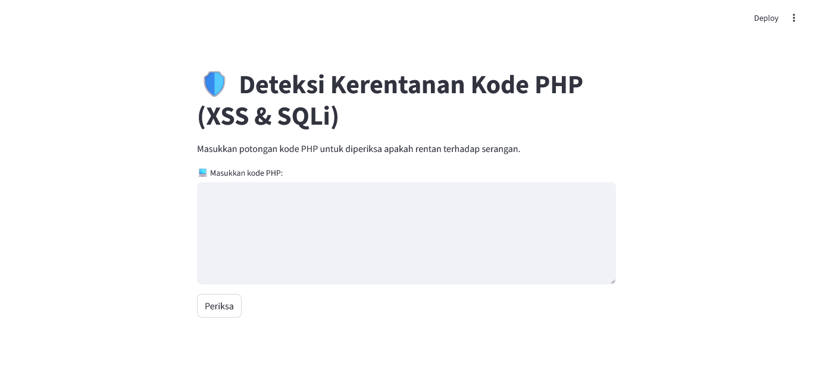
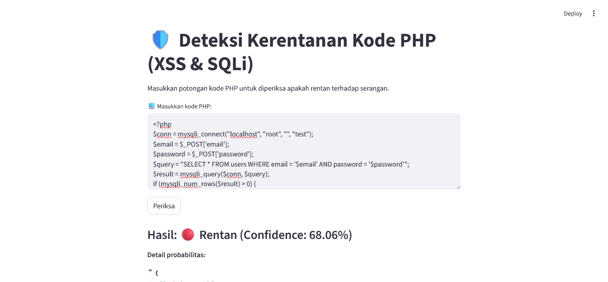
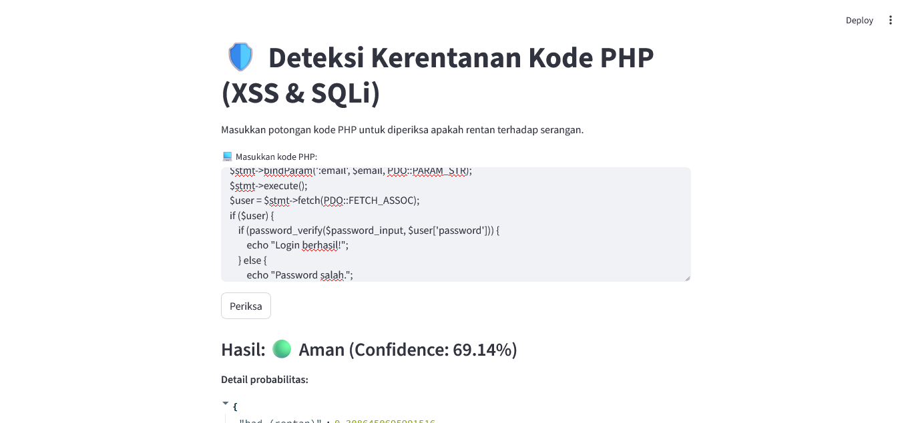

# 🛡️ PHP Vulnerability Detector

> A web-based application for detecting SQL Injection (SQLi) and Cross-Site Scripting (XSS) vulnerabilities in PHP code using a Machine Learning model powered by CodeBERT + LoRA. Built with Streamlit, this tool provides a simple and interactive interface for analyzing code security risks directly from your browser.
---



## ✨ Key Features
### 🔍 Vulnerability Detection
- Detects whether a PHP code snippet is vulnerable to SQL Injection (SQLi) and Cross-Site Scripting (XSS).
- Uses a fine-tuned CodeBERT model enhanced with LoRA.

### 📊 Confidence Score & Probabilities
- Displays the model’s confidence level for each prediction.
- Shows probability for two classes: bad (vulnerable) vs good (safe)

---

## 🧱 Tech Stack
### 🧠 Machine Learning
- CodeBERT (microsoft/codebert-base)
- LoRA (Low-Rank Adaptation) using PEFT
- PyTorch

### 🌐 Web Application
- Streamlit (UI + backend logic)
- Python 3.10+

---

## ⚙️ Installation & Setup
### 🧩 Requirements
- Python 3.7 or newer
- ```pip``` (Python package manager)
- GPU optional (CPU also supported)

### 🚀 Steps
```bash
# 1️⃣ Clone or download the repository
git clone https://github.com/ansmlptr/PHP-Vuln-Detection.git
cd PHP-Vuln-Detection

# 2️⃣ Install dependencies
pip install -r requirements.txt

# 3️⃣ Run the Streamlit Application
streamlit run app.py

# 4️⃣ Open your browser and visit:
http://localhost:8501
```

---
## 📂 Project Structure

```
PHP-Vuln-Detection/
│
├── app.py                 # Main Streamlit app
├── lora_model/            # LoRA fine-tuned model weights
├── requirements.txt       # Dependency list
└── README.md              # Project documentation

```
---

## 🧠 How It Works
1. User inputs a PHP code snippet.
2. The code is tokenized using CodeBERT’s tokenizer.
3. The CodeBERT + LoRA model processes the input and generates logits.
4. The app computes:
   - Prediction label: Vulnerable or Safe
   - Confidence score using softmax
5. Results are displayed instantly through the Streamlit interface.

---

## 📸 Example Output
| Label            | Screenshot             | Meaning |
| -----------------| -----------------------| --------|
| 🔴 Vulnerable   |  | Potential SQLi/XSS patterns detected |
| 🟢 Safe         |  | No vulnerability patterns detected |

---

## 👩‍💻 Developer
- **Name**: Anisa Amalia Putri
- **Email**: [ansmlptr03@gmail.com](mailto:ansmlptr03@gmail.com)
